<div id="top"></div>
<div align="center">
  <h2 align="center">Pathfinding Visualizer</h2>
  <p align="center">
    Capstone Project
    <br>
    Reece Taylor
<details>
  <summary>Contents</summary>
  <ol>
      <a href="#about-the-project">About The Project</a> |
      <a href="#getting-started">Getting Started</a> |
      <a href="#prerequisites">Prerequisites</a> |
      <a href="#installation">Installation</a> |
    <a href="#technical-documentation">Techincal Documentation</a> |
    <a href="#examples">Examples</a> |
    <a href="#contact">Contact</a> |
    <a href="#acknowledgments">Acknowledgments</a>
  </ol>
</details>
  </p>
</div>

## 🎓 About The Project

This project has been designed as an educational tool for individuals to learn about pathfinding algorithms and visualize the results.

The main premise for starting this project was becuase I didn't consider myself to have an extensive understanding of algorithms and how they work - a fundamental concept of computer science.

Through developing a visualization tool, I am teaching myself how algorithms react with my own eyes, not just through 1s and 0s.

My true objective of this project was simply to become a better computer scientist / programmer. I believe through choosing this project, I improved my skills exponentially by working on this project both with knowledge gained from research, and the new programming abilities I have learned by hard work.

<p align="right"><a href="#top">⬆️</a></p>

## ✅ Getting Started

### ⚠️ Prerequisites

* JDK 17 or later
  * <https://www.oracle.com/java/technologies/downloads/#jdk18-windows>
  * <https://www.oracle.com/java/technologies/downloads/#jdk18-mac>
  * <https://www.oracle.com/java/technologies/downloads/#jdk18-linux>

* Maven 3.8.x or later *(recommended)*
  * <https://maven.apache.org/download.cgi>
  * Installation guide - <https://maven.apache.org/install.html>

### 🖥️ Installation

Here I will desribe the process of installing the project. You can either run the already placed JAR file, or run the following commands to ensure the build is the latest.

1. Clone the repo

   ```sh
   git clone
   ```

2. Navigate to ImprovedVisualizer_jar directory.

3. Run the run.bat file.

### Using Maven *(recommended)*

Alternatively, if you want to ensure that the JAR file is the most up to date, you can build the project yourself using the following commands:

1. Clone the repo

   ```sh
   git clone 
    ```

2. Change directory to ImprovedVisualizer directory.

    ```sh
    cd
    ```

3. Now run a build with mvn

    ```sh
    mvn install
    ```

4. Navigate to the newly created folder which will contain the ImprovedVisualizer.jar file.

5. Run the JAR file.

    ```sh
    java -jar ImprovedVisualizer.jar
    ```


<video width="520" height="340" controls>
  <source src="Resources/maven-help.mp4" type="video/mp4">
</video>

<p align="right"><a href="#top">⬆️</a></p>

## 📝 Technical Documentation

In this section I will describe the technical details of the project from how the project is built, how the algorithms are implemented, and examples of how the project is used.

### Project Configuration
This project has taken an object-oriented approach. The project is divided into 9 classes, each intergral to each other.

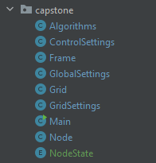

Due to the approach I have taken, it has allowed me to have greater control over the program and its functionality. The ease of adding in additonal features, from classes, heuristics and algorithms, has been a huge benefit to the development of this project.

The way each class talks to each other and how they interact with each other makes a huge difference to the overall functionality and even workflow of the project. This was a huge benefit to development and I am very proud of the way I have managed to achieve this. I had a previous iteration `PathfindingVisualizer(OLD)` which did get me started on the right foot, having only built a semi-decent iteration of A* Search, but thanks to the work I put into that, my programming skills and knowledge had improved exponentially, and so I decided to take the project further and make it much more effiecient. I have also added in a lot of new features, such as the ability to now change the algorithm, the ability to change the heuristic, the ability to generate a random maze, alongside node positioning and other huge quality of life improvements.

It took a lot of spare time and sacrifice to rebuild from the ground up close before the deadline, but I am incredibly proud of myself for managing to achieve the project I had envisioned when I first started.

I will first give an overview of the features within this program.

### Key
* Nodes: The nodes that the algorithm will visit,  each tile is a node.
* Start Node: 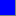 The node that the algorithm starts at.
* End Node:  The node that the algorithm ends at.
* Walls:  The walls that the algorithm will not visit.
* Open Node:  The node that the algorithm is currently visiting.
* Closed Node:  The node that the algorithm has already visited.
* Path:  The path that the algorithm has found.


### Nodes

This is what will appear once the program first runs:
<br>
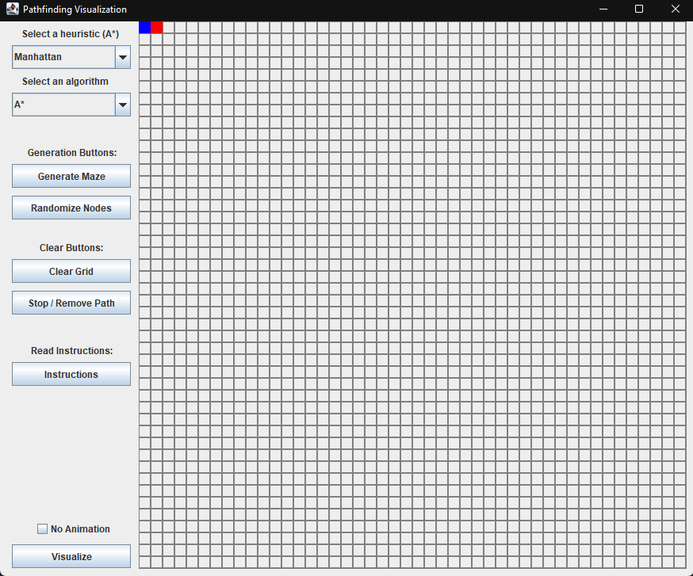
<br>
A 2D grid with each square representing a node. You'll see the starting (blue) and ending (red) nodes placed at the top left of the grid. Users are then free to move these arounds at their own discretion like so:
<br>
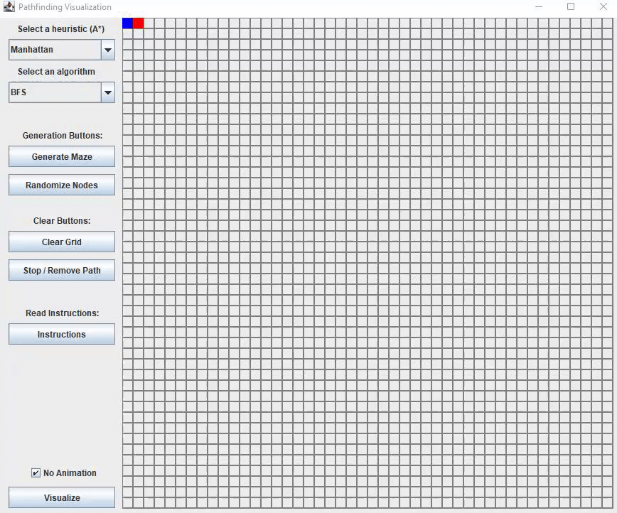

To give users a more interative experience, there is also a button in which will randomly generate new locations for the two start and end nodes.
<br>


### Walls
With the ability to move the nodes, the program also allows users to draw walls freely along the grid. This is done by clicking and dragging the mouse on a left click. On a right click, the wall will be removed.
<br>
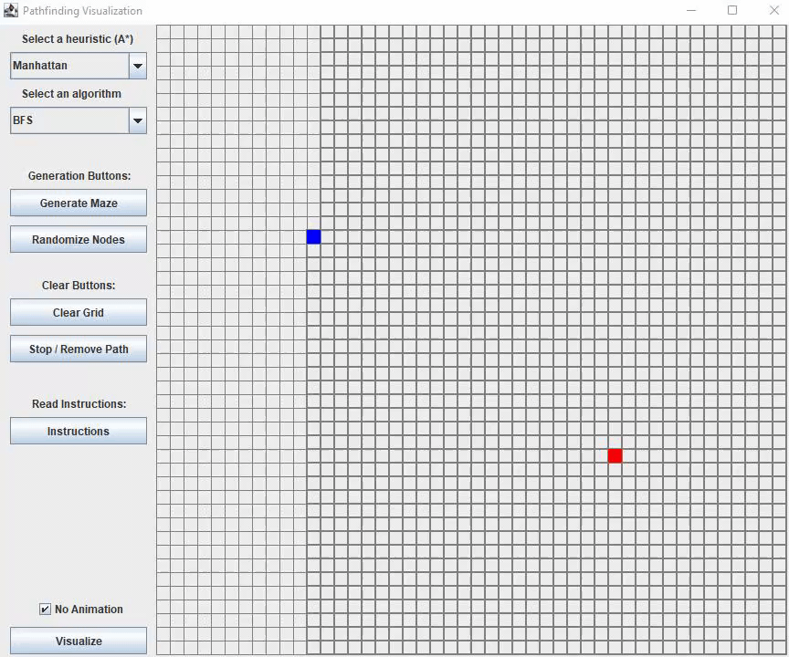
<br>
The idea of a user needing to draw a complete maze seems a bit daunting and time consuming. However, the main feature of this project is that the program will automatically generate a maze for the user on a click of the 'Generate Maze' button. This is a great quality of life feature for the user.
**Please note that the feature may not always generate a maze that will be solvable by the applied algorithm. This is intended.**
<br>


### Clearing Features
To remove as much user hassle as possible, I have implemented features in which will help the user completely clear the grid of the walls it may have drawn, without the user having to manually delete the walls, which would have been rather tedious and time consuming.
Simple, yet _effective_.
<br>
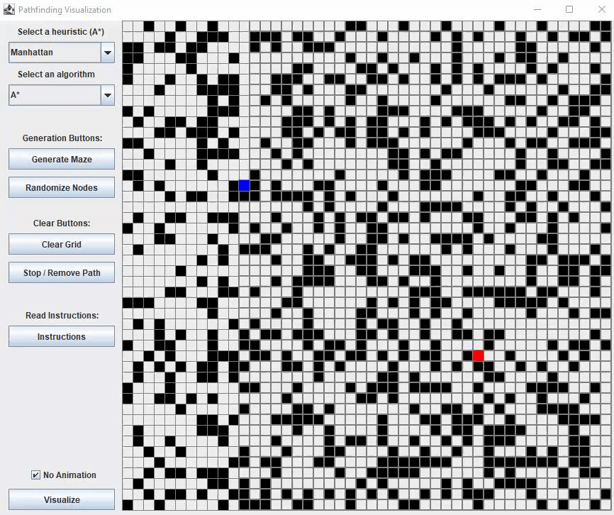
<br>
This next feature is especially useful for the user, while the program is searching, it will allow the user to stop the program and clear what the program has drawn so far as it was searching. After the program has finished searching, this button will act as a reset of the path that was drawn.
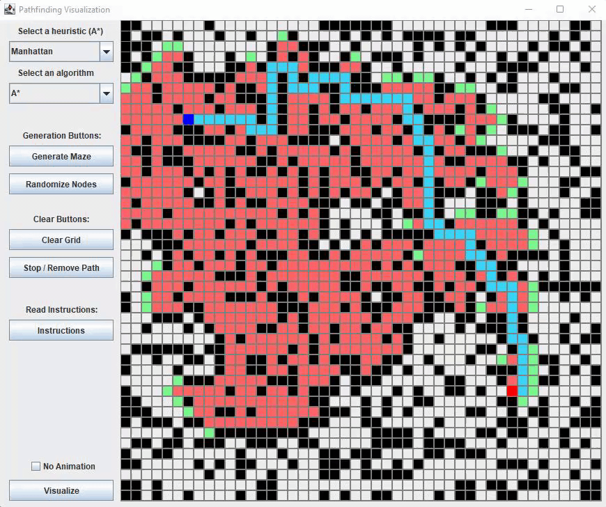

### Algorithms and Heuristics
The main show of this project is the use of algorithms and heuristics. The algorithms are implemented in the `Algorithms` class, and the heuristics are implemented in the `Node` class.
The algorithms are as follows:
* A-Star Search (A*)
* Breadth-First Search (BFS)
* Depth-First Search (DFS)

The main algorithm used in this project is A* Search. This algorithm is the most efficient and has the best performance out of the three algorithms introduced. A* makes used of heursistics to determine the best path to take based on the formula:

```
f(n) = g(n) + h(n)
```

Where `g(n)` is the cost of the path taken to get to the node, and `h(n)` is the heuristic value of the node.

The heuristics used are as follows:
* Manhattan Distance
* Euclidean Distance
* Diagonal Distance
* Dijkstra (no heuristic)
* Chebyshev Distance
* Random Walk Iteration

Below is an example of you would change the algorithm selected:
<br>
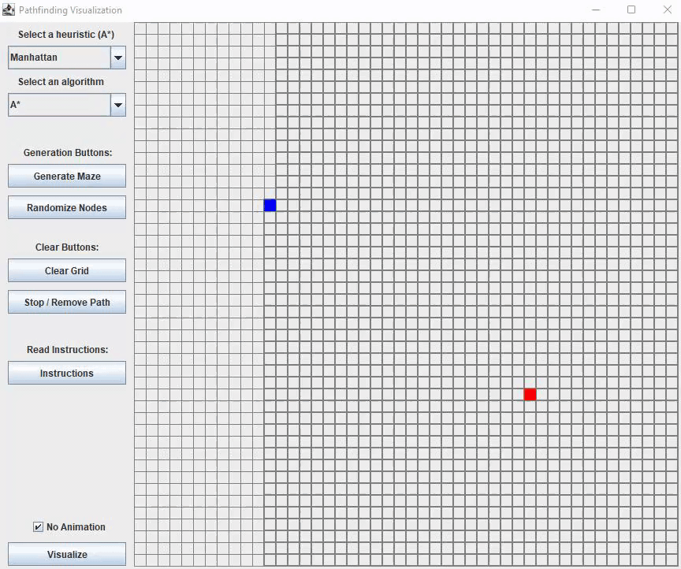
<br>
As you can see the change is instant and you can search the same maze preset with different algorithms, which is not only incredibly useful for debugging and testing, but also allows the user to see the different algorithms in action and how different algorithms will affect the path taken to the same starting and ending positions.
Below now is an example of how you would change the heuristic selected:
<br>
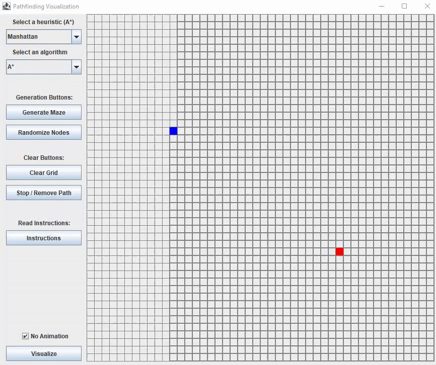
<br>
Again, super useful for the user to see how different heuristics will affect the path taken to the same starting and ending positions, but also allows the user to see how a slight change in the heuristic will impact things such as the amount of space it searched, how many nodes were visited (closed), and how many nodes are expanded (open).

### Disable Animation
As fun as it is to watch how the different algorithms and heuristics work, it can be quite time consuming to watch the program run. To make the program run faster, you can disable the animation by clicking the 'Disable Animation' button.
<br>
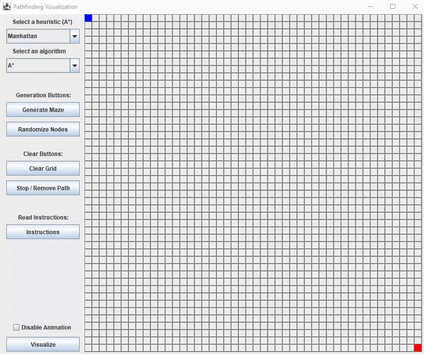
<p align="right"><a href="#top">⬆️</a></p>

## 📸 Examples
Below are some examples of how the different algorithms and A* heuristics search the same maze.

### A* Examples
* A* Manhattan Distance:
<br>
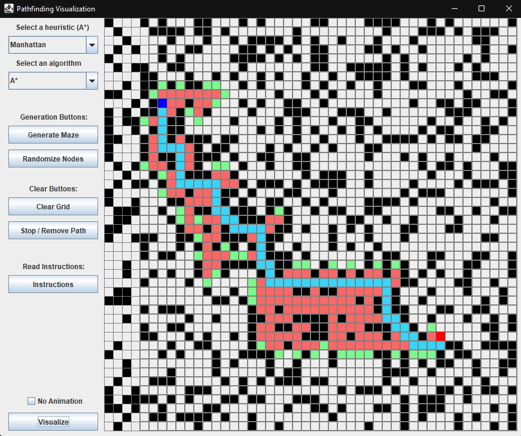
<br>
* A* Euclidean Distance:
<br>
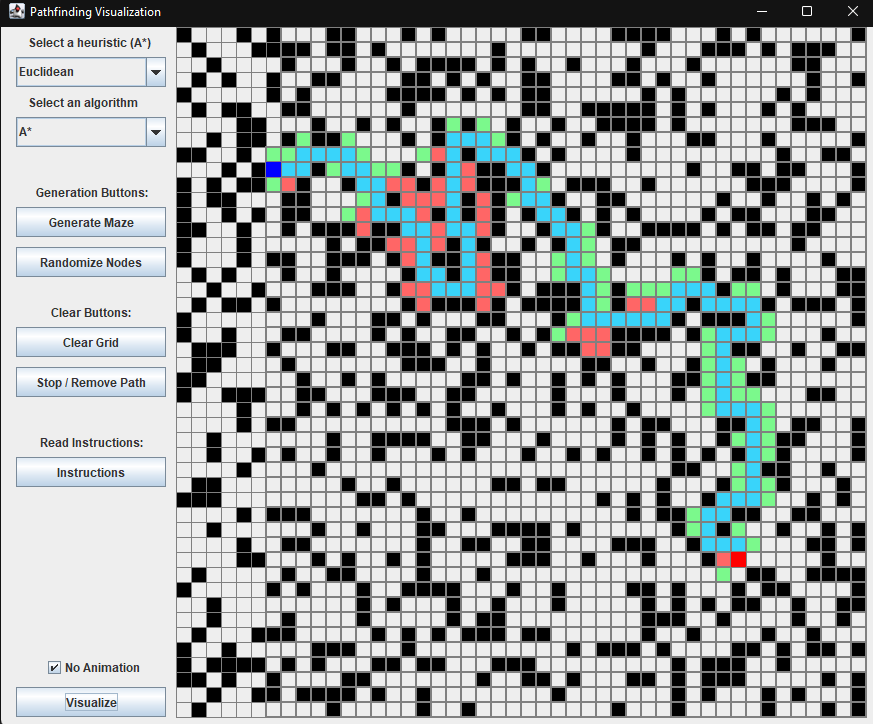
<br>
* A* Diagonal Distance:
<br>
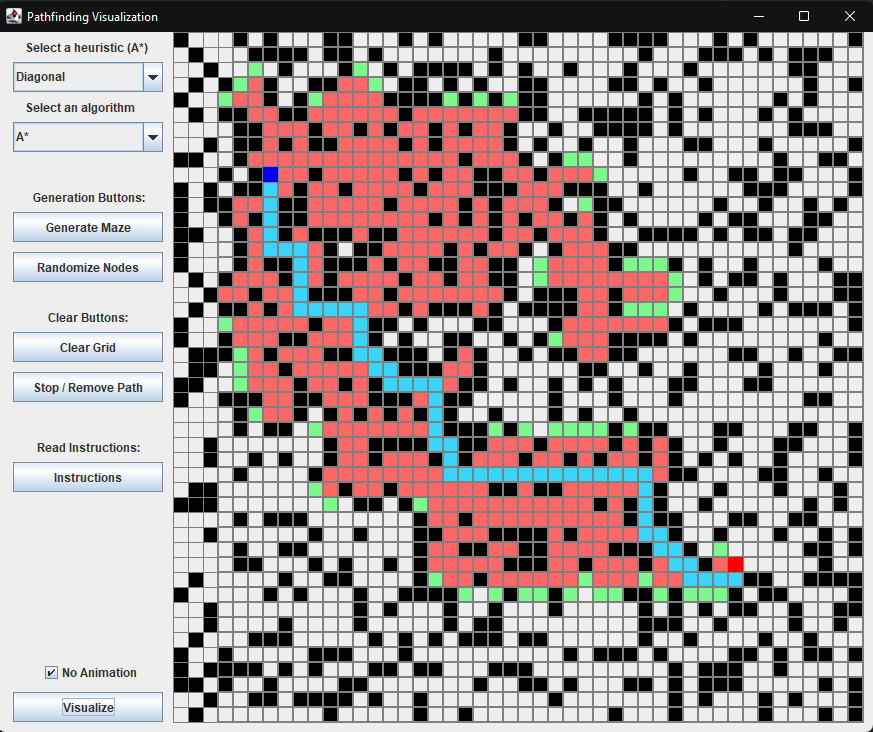
<br>
* A* Dijkstra:
<br>
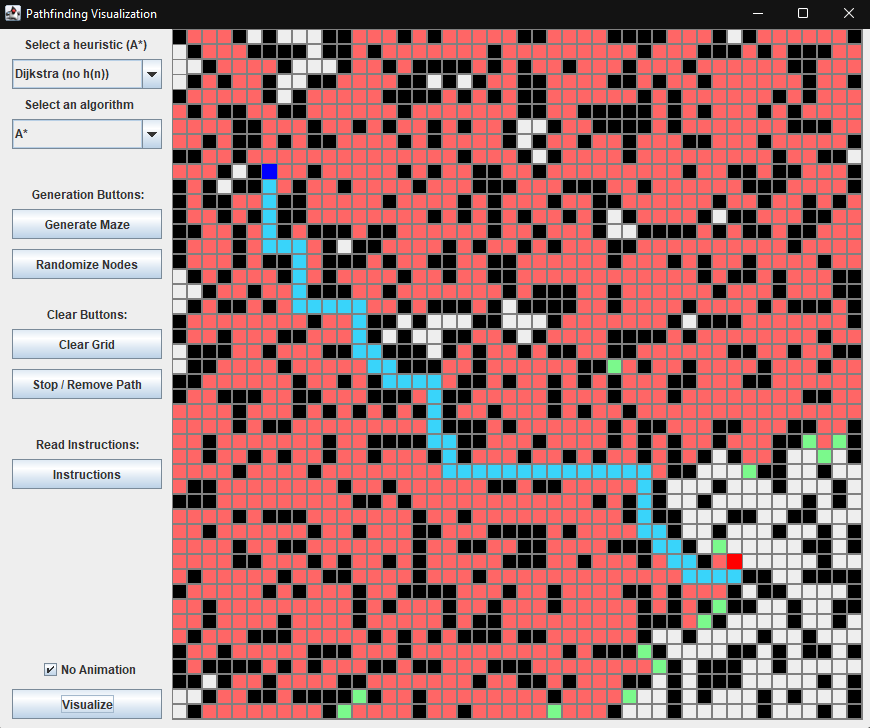


### BFS Examples
* BFS (walls):

<br>
* BFS (no walls):
<br>
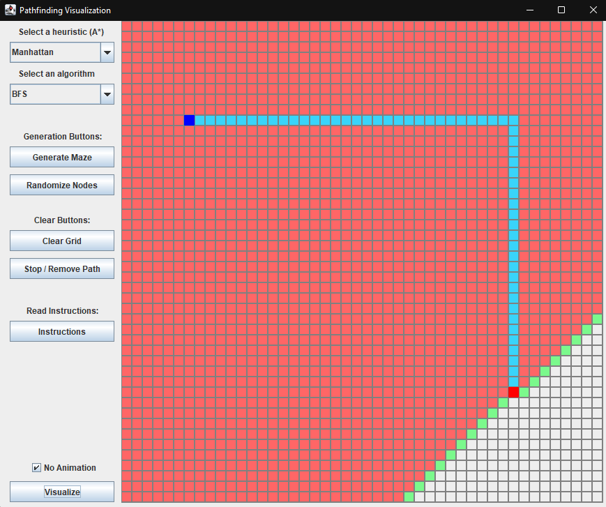

<p align="right"><a href="#top">⬆️</a></p>

## 🗺️ Roadmap
I will still be trying to add more features of this program up until the deadline, these will be added as I have time. These will mainly be features that would further enhance the users experience.

Additions:

* Add ability to change grid size.
* Finalize the DFS algorithm.

Bugs:
* As you drag the start node (blue) it will move as if it's a wall and leave a trail (minor - doesnt impact the way the program runs at all, clears when any button is pressed).


<p align="right"><a href="#top">⬆️</a></p>

## 🎫 License

Licensed under the [GNU General Public License v3.0](LICENSE).

<p align="right"><a href="#top">⬆️</a></p>


[first_wall]:(\resources\program_first_wall_generation.png)
[astar_nowall]:(\resources\program_first_visualize.png)
[first_screen]:(\resources\program_first_screen.png)

[draw_walls]:(\resources\draw-walls-function.gif)
[move_nodes]:(\resources\move-nodes-function.gif)

[heuristic_select]:(\resources\change-astar-heuristic-function.gif)
[Alg_select]:(\resources\change-algorithm-function.gif)

[gen_maze]:(\resources\gen-maze-function.gif)
[gen_nodes]:(\resources\gen-nodes-function.gif)

[clear_grid]:(\resources\clear-grid-function.gif)
[stop_remove]:(\resources\stop-remove-function.gif)

[move_nodes]:(\resources\move-nodes-function.gif)
[no_animation]:(\resources\no-animation-function.gif)


<!--- algorithm search examples -->
[bfs_walls]:(\resources\program_bfs_walls.png)
[bfs_nowalls]:(\resources\program_bfs_nowalls.png)
[astar_diagonal]:(\resources\program_astar_diagonal.png)
[astar_manhattan]:(\resources\program_astar_manhattan.png)
[astar_euclidean]:(\resources\program_astar_euclidean.png)
[astar_dikstra]:(\resources\program_astar_dikstra.png)
[astar_diagonal]:(\resources\program_astar_diagonal.png)
[astar_random]:(\resources\program_astar_random.png)
[astar_random2]:(\resources\program_astar_random2.png)
[astar_random3]:(\resources\program_astar_random3.png)
